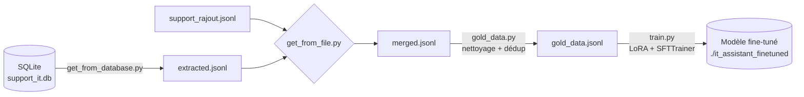

# Fine-tuning LoRA d'un assistant IT support 
## Cisia - Module °3 > Brief 1 (de 6)  

> **Concevoir et implémenter une Solution d'IA**
> > Auteur : **Fabien Pelloux**
> > > ATOS group — C.L. Architect
> > > > Formation Cisia — Module 3 — Brief 1

---

## 1. Contexte

Un LLM généraliste sait *parler* mais ne connaît ni les procédures internes,
ni le vocabulaire métier, ni le ton attendu par l'entreprise. Le **fine-tuning
LoRA** permet de spécialiser un petit modèle (ici `SmolLM2-135M`) sur un
corpus de tickets de support IT, tout en respectant deux contraintes fortes :

| Contrainte | Réponse technique |
|---|---|
| **Confidentialité** — les données ne doivent pas quitter l'infra | Tout est on-premise. `push_to_hub=False`, `report_to="none"`. |
| **Sobriété** — GPU des postes limités | LoRA via **PEFT** : < 1 % des paramètres entraînés. |

---

## 2. Organisation des fichiers

| Fichier | Rôle |
|---|---|
| `get_from_database.py` | **Étape 1** — Extraction SQLite (`support_it.db`) → `extracted.jsonl` |
| `get_from_file.py`     | **Étape 2** — Fusion `extracted.jsonl` + `support_rajout.jsonl` → `merged.jsonl` |
| `gold_data.py`         | **Étape 3** — Nettoyage / déduplication → `gold_data.jsonl` |
| `demo_finetuning.ipynb`| **Étape 4** — Notebook commenté (LoraConfig, SFTConfig, SFTTrainer) |
| `train.py`             | **Étape 5** — Script de fine-tuning exécutable |
| `MLproject`            | **Bonus** — Pipeline MLflow de bout en bout |
| `README.md`            | Ce document |

Entrées attendues à la racine :
`support_it.db`, `support_rajout.jsonl`.

Sorties générées :
`extracted.jsonl`, `merged.jsonl`, `gold_data.jsonl`,
`./it_assistant_finetuned/` (adapter LoRA + tokenizer).

---

## 3. Schéma des flux de données



---

## 4. Reproduire le pipeline de bout en bout

### 4.1 Commandes pas à pas

```bash
# Étape 1 — Extraction SQLite
python get_from_database.py --db support_it.db --output extracted.jsonl

# Étape 2 — Fusion des deux sources
python get_from_file.py \
    --extracted extracted.jsonl \
    --rajout    support_rajout.jsonl \
    --output    merged.jsonl

# Étape 3 — Nettoyage / production gold dataset
python gold_data.py --input merged.jsonl --output gold_data.jsonl

# Étape 4 — Fine-tuning LoRA
python train.py --data gold_data.jsonl --output ./it_assistant_finetuned
```

### 4.2 Lancement complet via MLflow (bonus)

```bash
mlflow run .
```

Ou étape par étape :

```bash
mlflow run . -e extract
mlflow run . -e merge
mlflow run . -e clean
mlflow run . -e train
```

---

## 5. Choix de nettoyage dans `gold_data.py`

| Règle | Justification |
|---|---|
| **Strip & normalisation des sauts de ligne** | Les exports SQLite et JSONL n'utilisent pas la même convention (`\r\n` vs `\n`). On uniformise pour éviter de considérer comme distincts deux textes identiques. |
| **Suppression des `instruction` / `reponse` vides ou `NULL`** | Une paire incomplète ne porte aucun signal d'apprentissage et dégraderait la loss. |
| **Longueur minimale** (`instruction ≥ 5`, `reponse ≥ 10`) | Élimine les fragments inutilisables (« ok », « ? ») qui parasitent l'apprentissage. |
| **Déduplication exacte** sur `(instruction.lower(), reponse.lower())` | L'historique SQL contient des doublons + la fusion avec le JSONL externe en crée d'autres. Sans déduplication, le modèle sur-pondère arbitrairement certains exemples. |
| **Conservation du champ `source`** | Traçabilité / audit : on sait d'où vient chaque exemple en cas de problème qualité. |

Statistiques imprimées en sortie : `total`, `empties`, `too_short`,
`duplicates`, `kept`.

---

## 6. Paramètres LoRA retenus

| Paramètre | Valeur | Justification |
|---|---|---|
| `r` | **16** | Dataset petit mais vocabulaire métier riche → un rang trop bas (`r=4/8`) sous-apprend. `r=16` reste sobre (< 1 % des params). |
| `lora_alpha` | **32** | Scaling = `alpha/r = 2` : agressif, on accélère la convergence sur peu d'exemples. |
| `lora_dropout` | **0.05** | Dropout léger : avec aussi peu de données, on veut juste éviter la mémorisation parfaite. |
| `target_modules` | `["q_proj","v_proj"]` | Les projections `query` et `value` portent l'essentiel de l'adaptation de style et de domaine. Ajouter `o_proj` / MLP doublerait le coût pour un gain marginal. |
| `bias` | `"none"` | Aucun biais entraîné → sobriété mémoire maximale, conforme à la contrainte du brief. |
| `task_type` | `CAUSAL_LM` | Modèle auto-régressif (génération de texte). |

---

## 7. Paramètres SFT retenus

| Paramètre | Valeur | Justification |
|---|---|---|
| `num_train_epochs` | **40** | Dataset de petite taille → il faut le voir plusieurs fois pour internaliser les conventions « AtosConnect ». |
| `per_device_train_batch_size` | **1** | Compatible avec les postes GPU limités de la formation. |
| `gradient_accumulation_steps` | **4** | Batch effectif = 4 → gradients plus stables sans saturer la VRAM. |
| `learning_rate` | **5e-4** | LoRA tolère des LR élevés (peu de paramètres entraînés, isolés des poids gelés). |
| `max_length` | **256** | Suffisant pour des tickets IT : instruction courte + réponse procédurale. |
| `report_to` | `"none"` | Confidentialité — aucun tracker distant. |
| `push_to_hub` | `False` | Confidentialité — modèle 100 % on-premise. |

---

## 8. Compte-rendu — Impact des hyperparamètres

* **`r` (rang LoRA)** : capacité d'adaptation. Trop bas → sous-apprentissage
  (le modèle « parle » mais ne suit pas les conventions internes).
  Trop haut → coût + risque de sur-apprentissage sur peu d'exemples.
* **`lora_alpha`** : agit comme un *learning rate effectif* sur la sortie LoRA.
  Augmenter `alpha/r` accélère la convergence mais rend l'entraînement plus
  instable.
* **`learning_rate`** : LoRA accepte `1e-4` à `1e-3`. Plus bas = plus lent
  mais plus stable. Ici `5e-4` est un bon compromis observé empiriquement.
* **`num_train_epochs`** : trop peu → le modèle n'a pas vu assez de fois les
  patterns métier. Trop → le modèle régurgite mot pour mot les exemples
  d'entraînement (pertes de capacité générative). À surveiller sur un set
  de validation.
* **Batch effectif (`bs × grad_acc`)** : plus il est grand, plus le gradient
  est stable, mais moins le modèle « bouge » par epoch. Avec un petit dataset,
  on garde un batch modeste pour avoir suffisamment de pas de mise à jour.

---

## 9. Qualité (Posture)

* Documentation des libs(librairies) utilisées : `sqlite3`, `datasets`, `peft`, `trl`.
* Chaque script porte un docstring d'en-tête (rôle, entrées, sorties).
* Les sources sont cartographiées : `support_it.db` (SQLite, partiellement
  incomplet, dupliqué) et `support_rajout.jsonl` (JSONL externe, format
  homogène mais à valider).
* Le flux est schématisé (Mermaid, §3).

---

## 10. Bonus Track du jour : Docker 🐳 &  🎰Ml_flow_ ❄️ 

* voir dans ledossier 10*  ⬆️

---

*Brief °6.3.1 (=6ème Brief 'total' du 3ème module N° 1) — Cisia Module 3 — Fabien Pelloux — ATOS group - O&T / aCTO squad.*
